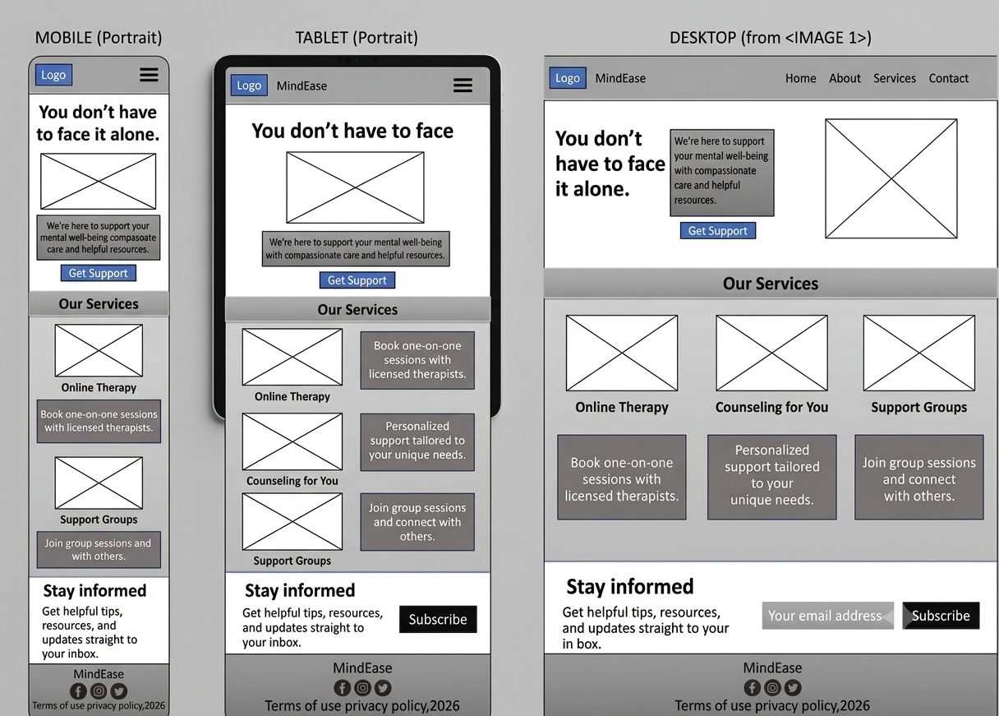

# 🌿 MindEase

MindEase is a fully responsive mental‑wellbeing platform built using **HTML5**, **CSS3**, and **Bootstrap 5**.  
It provides users with a calm, supportive digital space where they can explore therapy options, mindfulness tools, emotional guidance, and wellness programs.

🌐 **Live Website:** https://shrutijind.github.io/mind_ease/

---

## 🏷️ Badges

---

## 📘 Project Overview

MindEase is designed as a mental‑health support interface that offers:

- Emotional guidance through structured support sections  
- Professional service listings (therapy sessions, wellness programs, mindfulness training)  
- Interactive components (contact forms, subscription forms)  
- Calming visual design using soft colors, balanced spacing, and supportive imagery  
- Clear navigation across multiple pages (Home, About, Services, Support, Contact)

The website is intentionally built as a **static multi‑page application**, making it lightweight, fast, and easy to deploy on GitHub Pages.

---

# 🧩 MoSCoW User Stories

## ✅ Must‑Have

### **User-Friendly Navigation & Responsive Design**
- Navbar visible on all pages  
- Mobile hamburger menu  
- Footer with social icons  
- Social links open in new tab  

### **Hero Section**
- Headline + description  
- Contact Us button  
- Responsive layout  

### **Services Overview**
- Service cards with image, title, description  
- Responsive grid  

### **Client Testimonials**
- Testimonials with name, photo, feedback  
- Responsive layout  

### **Contact Form**
- Name, email, subject, message fields  
- Validation  
- Confirmation message  

---

## ⭐ Should‑Have

### **Detailed Services Page**
- Dedicated page  
- Images + descriptions + CTA  

### **About Us Page**
- Mission, values, team bios  
- Responsive layout  

---

## 💡 Could‑Have

### **Newsletter Sign-Up**
- Footer form  
- Name + email fields  

### **Blog Section**
- Blog page  
- Posts with title, author, date  

---

# 🧱 Wireframes

### 📱 Mobile Wireframe  

# ✒️ Typography

MindEase uses a calm, modern, and highly readable typography system.

### **Primary Font — Poppins**
Used for:
- Headings  
- Titles  
- Buttons  
- Navigation  

### **Secondary Font — Open Sans**
Used for:
- Body text  
- Paragraphs  
- Descriptions  

---

# 🧩 Features

## ✔ Current Features
- Navigation bar  
- Hero section  
- Mental health awareness section  
- Cards for improving mental health  
- Helping others section  
- Contact details with social icons  
- Footer  

## 🔮 Future Features
- Seeking help resource section  
- Image carousel in header  

---

# 🧪 Testing

### **HTML Validation**
Validated using **W3C Markup Validation Service** — all issues resolved.

### **CSS Validation**
Validated using **W3C CSS Validator** — no issues found.

---

# 🚀 Deployment (GitHub Pages)

1. Log into GitHub  
2. Open repository  
3. Go to **Settings → Pages**  
4. Under *Build and Deployment*, choose branch: **Main**  
5. Click **Save**  
6. Visit deployed site:  
   https://shrutijind.github.io/mind_ease/

---

# 📚 Credits

- **Bootstrap** — Layout & components  
- **Code Institute** — Learning materials  
- **ChatGPT** — Guidance & troubleshooting  
- **Google Fonts** — Poppins & Open Sans  
- **Font Awesome** — Icons  
- **W3C Validators** — HTML & CSS validation  
- **GitHub Copilot** — Coding assistance  
- **Pexels** — Images  

---

# 📧 Contact

For questions or collaboration:  
**shruti@example.com** (replace with your email)

